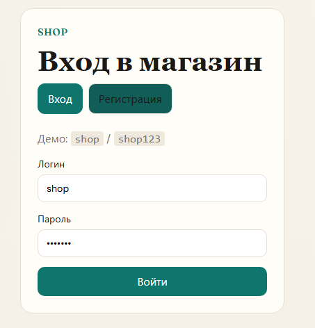
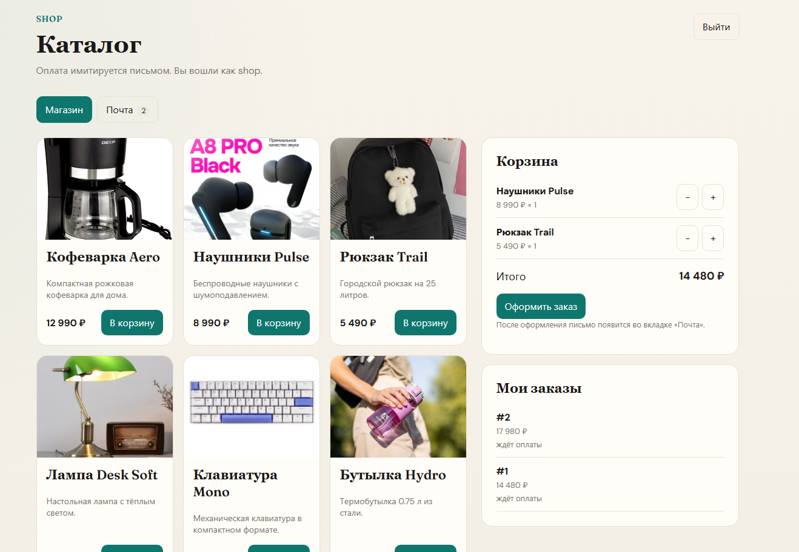
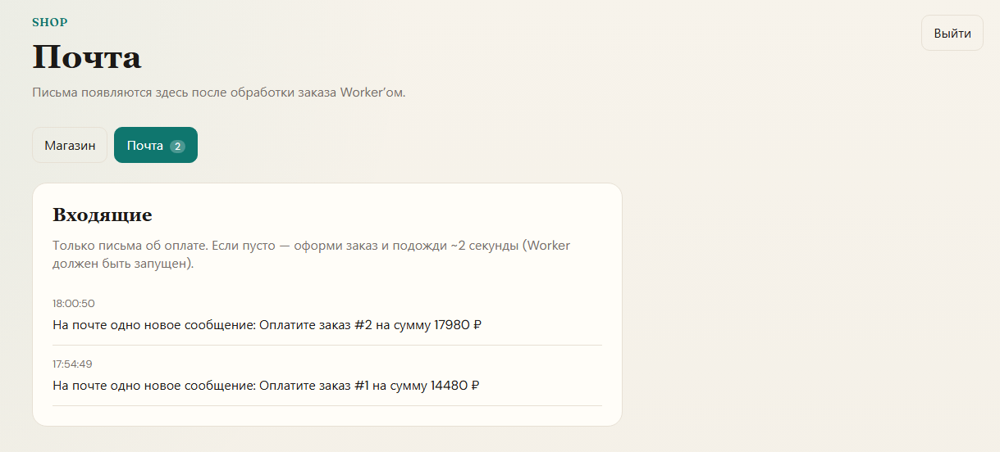

# Shop — учебный интернет-магазин

Учебный интернет-магазин на современном стеке: каталог товаров, корзина, заказы, JWT-аутентификация, очередь RabbitMQ, фоновый Worker («письмо об оплате») и push-уведомления в UI через SignalR.

## Технологии

- .NET 10, Minimal APIs, EF Core, Npgsql
- MassTransit 8.5.x + RabbitMQ
- SignalR
- JWT Bearer
- React 19, Vite, TypeScript
- Docker Compose
- xUnit, Moq, EF InMemory

## Скриншоты

### Вход и регистрация



### Каталог, корзина и заказы



### Почта (письма от Worker через SignalR)



## Содержание

- [Технологии](#технологии)
- [Скриншоты](#скриншоты)
- [Архитектура](#архитектура)
- [Структура репозитория](#структура-репозитория)
- [Сервисы и порты](#сервисы-и-порты)
- [Быстрый старт (Docker Compose)](#быстрый-старт-docker-compose)
- [Локальная разработка (3 консоли)](#локальная-разработка-3-консоли)
- [Учётные данные](#учётные-данные)
- [База данных](#база-данных)
- [Очереди RabbitMQ](#очереди-rabbitmq)
- [API и SignalR](#api-и-signalr)
- [Тесты](#тесты)
- [Полезные команды](#полезные-команды)

---

## Архитектура

```text
Браузер
   |
   v
 web (nginx :8088)  --/api, /hubs-->  api (ASP.NET :8080 внутри / :5007 снаружи)
                                        |
                    +-------------------+-------------------+
                    v                   v                   v
               PostgreSQL            RabbitMQ            SignalR
               (данные)           (сообщения)         (push в браузер)
                                        |
                                        v
                                   worker
                          (письмо -> ActivityLogs ->
                           событие mail-received -> api)
```

Типичный сценарий заказа:

1. Пользователь оформляет заказ в UI.
2. `api` сохраняет `Orders` / `OrderItems` и публикует `OrderCreated` в RabbitMQ.
3. `worker` получает сообщение, через ~2 секунды записывает строку в `ActivityLogs` («На почте…») и публикует `MailReceived`.
4. `api` получает `MailReceived` и отправляет событие клиенту через SignalR — вкладка «Почта» обновляется без polling.

---

## Структура репозитория

- `ShopApi/` — Minimal API (.NET 10): JWT, каталог, заказы, SignalR, миграции EF
- `Shop.Worker/` — фоновый сервис: потребитель `order-created`
- `Shop.Web/` — React + Vite + TypeScript (витрина)
- `Shop.Contracts/` — общие сообщения очередей (`OrderCreated`, `MailReceived`)
- `Shop.Data/` — общая модель `ActivityLog` / контекст для Worker
- `ShopApi.Tests/` — xUnit-тесты сервисов
- `docker-compose.yml` — Postgres, RabbitMQ, Adminer, api, worker, web
- `Shop.slnx` — solution для .NET-проектов

---

## Сервисы и порты

В Docker Desktop порты отображаются как **`порт_на_хосте:порт_внутри_контейнера`**.

```text
Сервис      Порт хоста  Внутри      URL / назначение
---------   ---------   ---------   ------------------------------------------
web         8088        80          http://localhost:8088  сайт магазина
api         5007        8080        http://localhost:5007  API напрямую
worker      -           -           без внешнего порта (только сеть Compose)
postgres    5432        5432        база shop
rabbitmq    5672        5672        AMQP
rabbitmq    15672       15672       http://localhost:15672  Management UI
adminer     8080        8080        http://localhost:8080  веб-клиент БД
```

**Почему сайт на 8088, а API на 5007?** Это два разных контейнера:

- **8088** — фронтенд (основной вход в приложение)
- **5007** — backend, доступный с хоста для отладки API

В режиме Compose браузер обращается к `8088`, а nginx в сервисе `web` проксирует:

- `/api/*` → `api:8080`
- `/hubs/*` → `api:8080` (SignalR / WebSocket)

Для обычной работы достаточно адреса **http://localhost:8088**.

При локальной разработке без контейнера `web` Vite использует порт **5173** (`npm run dev`).

---

## Быстрый старт (Docker Compose)

### Требования

- Docker Desktop
- (опционально) .NET 10 SDK и Node.js — для локальной разработки и тестов

### Сборка и запуск

Из корня репозитория:

```powershell
docker compose up -d --build
```

- `-d` — запуск в фоне
- `--build` — пересборка образов `api`, `worker`, `web`

### Проверка

```powershell
docker compose ps
```

Приложение доступно по адресу http://localhost:8088.

Учётная запись по умолчанию: `shop` / `shop123`.

### Остановка

```powershell
docker compose down
```

Данные Postgres сохраняются в томе `shop-pgdata`. Чтобы удалить контейнеры вместе с томом:

```powershell
docker compose down -v
```

### Логи

```powershell
docker compose logs -f api worker web
```

---

## Локальная разработка (3 консоли)

Этот режим удобен, когда нужен hot reload: инфраструктура работает в Docker, приложения — на хосте.

### 0. Инфраструктура

```powershell
docker compose up -d postgres rabbitmq adminer
```

Если ранее был запущен полный стек Compose, перед локальным `dotnet run` остановите контейнеры приложений, чтобы освободить порты:

```powershell
docker compose stop api worker web
```

### 1. API

```powershell
cd ShopApi
dotnet run --launch-profile http
```

API будет доступен по адресу http://localhost:5007.

### 2. Worker

```powershell
cd Shop.Worker
dotnet run
```

### 3. Frontend

```powershell
cd Shop.Web
npm install
npm run dev
```

UI будет доступен по адресу http://localhost:5173. По умолчанию фронтенд обращается к API `http://localhost:5007`.

---

## Учётные данные

```text
Сервис              Логин     Пароль
-----------------   -------   --------
Магазин (seed)      shop      shop123
PostgreSQL          shop      shop
База данных         shop      -
RabbitMQ            shop      shop
```

Adminer: http://localhost:8080

- System: **PostgreSQL**
- Server: **postgres** (из другого контейнера Compose) или **localhost** (подключение с хоста)
- Username / Password / Database: **shop**

Параметры JWT для разработки задаются в `ShopApi/appsettings.json` и в `docker-compose.yml` (`Jwt__Key`, `Jwt__Issuer`, `Jwt__Audience`).

---

## База данных

СУБД: **PostgreSQL 17**.

Миграции EF Core применяются при старте `ShopApi` (`MigrateAsync` + seed).

### `Users`

```text
Колонка         Тип     Описание
-------------   -----   ------------------------------------------
Id              int     PK
UserName        text    логин
PasswordHash    text    хэш пароля (PasswordHasher)
```

### `Products`

```text
Колонка         Тип       Описание
-------------   -------   ------------------------------------------
Id              int       PK
Name            text      название
Description     text      описание
Price           numeric   цена (руб.)
ImageUrl        text      путь, напр. /products/coffee.jpg
```

При первом запуске создаётся 6 товаров (кофеварка, наушники, рюкзак, лампа, клавиатура, бутылка).

### `Orders`

```text
Колонка         Тип           Описание
-------------   -----------   ------------------------------------------
Id              int           PK
UserName        text          владелец заказа
CreatedAt       timestamptz   время создания
Total           numeric       сумма
Status          text          например AwaitingPayment
```

### `OrderItems`

Позиции заказа. Одинаковые товары в разных заказах не являются дубликатами: у каждой строки свой `OrderId`.

```text
Колонка         Тип       Описание
-------------   -------   ------------------------------------------
Id              int       PK
OrderId         int       FK -> Orders
ProductId       int       id товара на момент заказа
ProductName     text      снимок названия
UnitPrice       numeric   снимок цены
Quantity        int       количество
```

### `ActivityLogs`

Журнал активности / «письма» (Worker записывает сообщения об оплате).

```text
Колонка         Тип           Описание
-------------   -----------   ------------------------------------------
Id              int           PK
CreatedAt       timestamptz   время
TaskId          int?          id заказа (историческое имя колонки)
Message         text          для почты начинается с:
                              "На почте одно новое сообщение:"
```

### Строка подключения

С хоста:

```text
Host=localhost;Port=5432;Database=shop;Username=shop;Password=shop
```

Из контейнеров `api` / `worker` вместо `localhost` используется хост **`postgres`**.

### Очистка данных

```sql
-- только «почта»
TRUNCATE TABLE "ActivityLogs" RESTART IDENTITY;

-- заказы и позиции
TRUNCATE TABLE "OrderItems", "Orders" RESTART IDENTITY;
```

---

## Очереди RabbitMQ

```text
Очередь           Сообщение                                      Публикует   Потребляет
---------------   --------------------------------------------   ---------   ----------------
order-created     OrderCreated(OrderId, UserName, Total)         api         worker
mail-received     MailReceived(Id, CreatedAt, TaskId,            worker      api -> SignalR
                    Message, UserName)
```

Management UI: http://localhost:15672 (логин / пароль: `shop` / `shop`).

Контракты сообщений находятся в проекте `Shop.Contracts`.

---

## API и SignalR

Основные HTTP-эндпоинты (`ShopApi`):

```text
Метод   Путь              Auth   Описание
-----   ---------------   ----   --------------------------------
POST    /auth/login       нет    вход, JWT
POST    /auth/register    нет    регистрация, JWT
GET     /products         да     каталог
GET     /orders           да     заказы текущего пользователя
POST    /orders           да     создать заказ
GET     /activity-logs    да     «почта» пользователя
```

SignalR hub: **`/hubs/mail`** (JWT передаётся через query-параметр `access_token`).

Событие на клиенте: `mailReceived`.

В Docker-сборке UI использует относительный базовый путь `/api` (прокси nginx).

---

## Тесты

Из корня репозитория:

```powershell
dotnet test ShopApi.Tests
```

Покрыты unit-сценарии: регистрация и логин, каталог, создание заказа (MassTransit замокан через Moq), InMemory EF.

---

## Полезные команды

```powershell
# статус сервисов
docker compose ps

# пересборка только приложений
docker compose up -d --build api worker web

# подключение к psql
docker compose exec postgres psql -U shop -d shop

# сборка solution
dotnet build Shop.slnx
```

### Когда какой режим использовать

- **Только запустить магазин** — `docker compose up -d --build`, затем http://localhost:8088
- **Разрабатывать с hot reload** — Postgres и RabbitMQ в Docker; `api`, `worker`, `web` в отдельных терминалах
- **Просмотреть БД** — Adminer: http://localhost:8080
- **Просмотреть очереди** — RabbitMQ UI: http://localhost:15672
